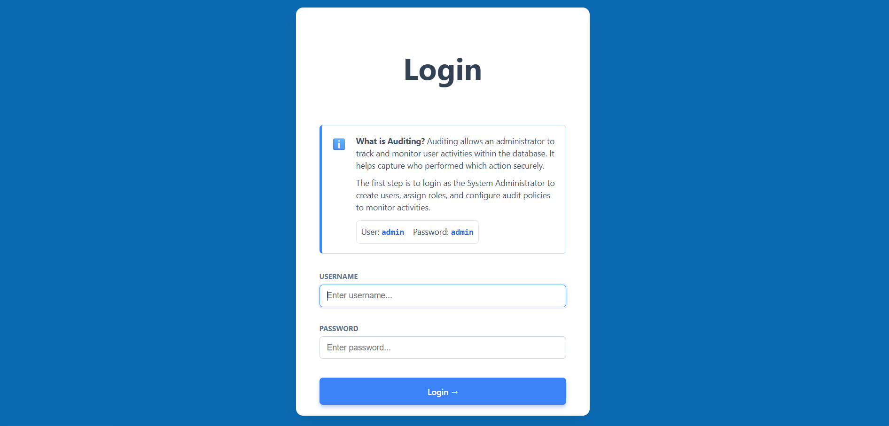
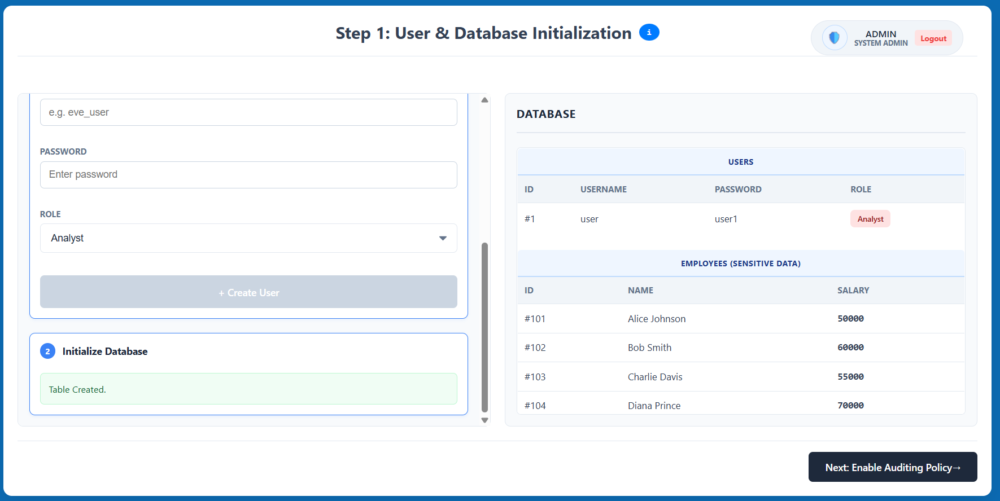
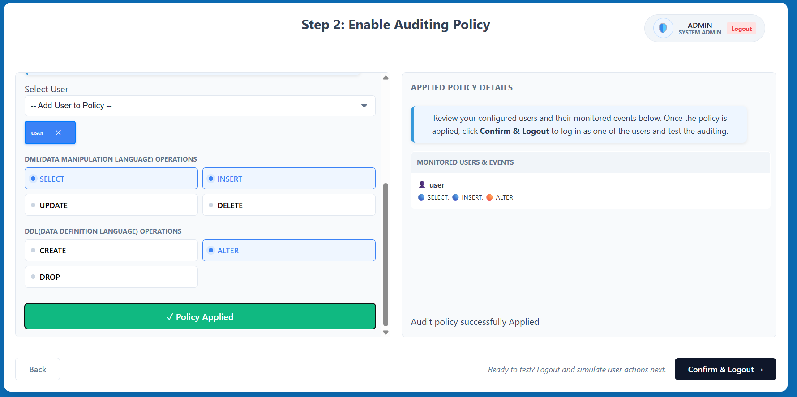
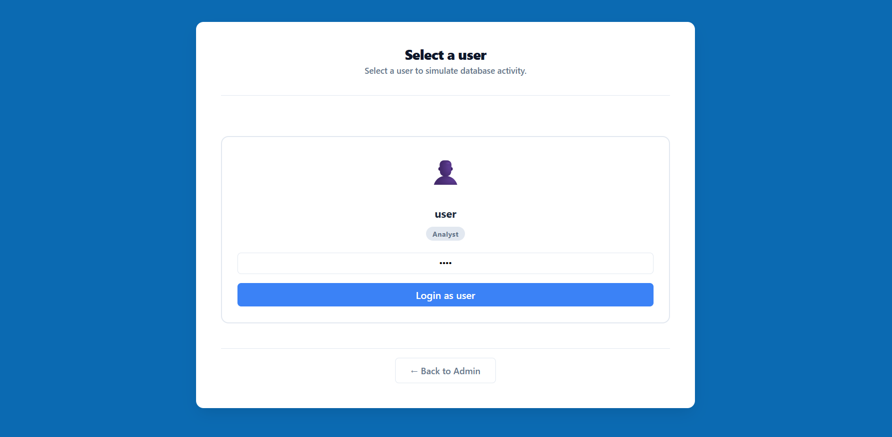
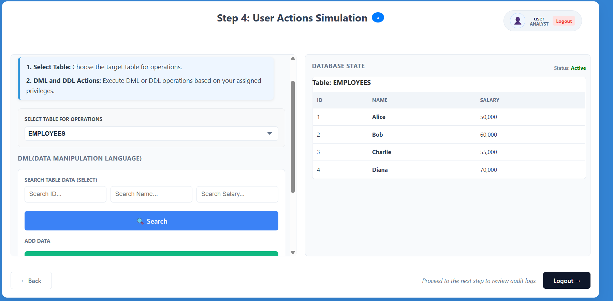
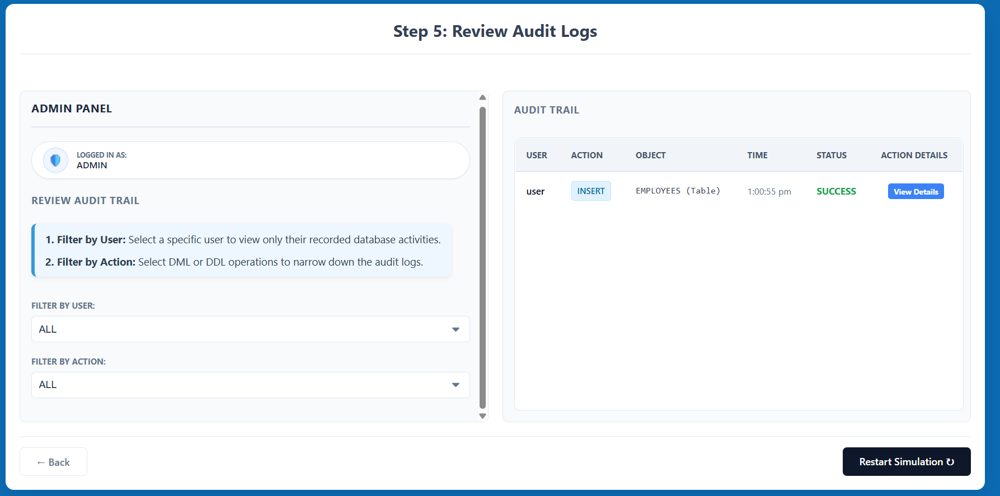

**Admin Login**

*   Navigate to the simulation start page.
*   Log in using the provided Admin credentials (Username: **admin**, Password: **admin**).
*   This first step allows you to access the management tools to configure auditing.

**Step 1: User & Database Initialization**
*   Create a new user by entering a username and password, then selecting a role (e.g., Analyst).
*   Initialize the database with dummy data (e.g., the `EMPLOYEES` table) to use for testing.
*   Review the generated list in the database panel and click **Next: Enable Auditing Policy**.

**Step 2: Enable Auditing Policy**

*   Select the user you created from the dropdown menu to start monitoring them.
*   Select specific Data Manipulation Language (DML) operations (SELECT, INSERT, etc.) and Data Definition Language (DDL) operations (CREATE, ALTER, etc.) to track.
*   Click **Enable Auditing** to apply the policy, then click **Confirm & Logout** to transition to the user simulation.

**Step 3: User Selection**

*   The system will prompt you to select a user for the simulation session.
*   Choose the user for whom you previously enabled the auditing policy and enter their credentials.
*   Click **Login as user** to enter the restricted database environment.

**Step 4: User Actions Simulation**

*   Interact with the database interface as the selected user.
*   Attempt various operations like searching for records (**SELECT**) or adding data (**INSERT**).
*   Observe how the system tracks these actions and restricts unauthorized activities based on the role.
*   Click **Logout** when you are ready to review the collected audit logs.

**Step 5: Review Audit Logs**

*   Log back in as the Admin to access the auditing results.
*   Review the **Audit Trail** table, which displays the user, action performed, object affected, timestamp, status (SUCCESS/FAILURE), and action details.
*   Use the **Filter by User** or **Filter by Action** options to narrow down the audit logs and analyze specific behaviors.

